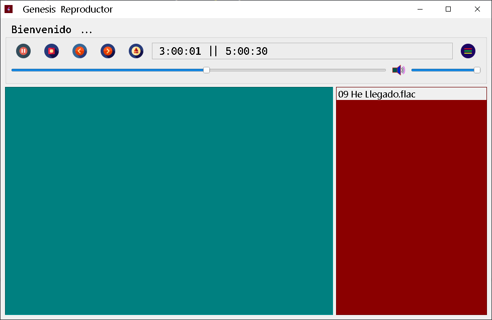
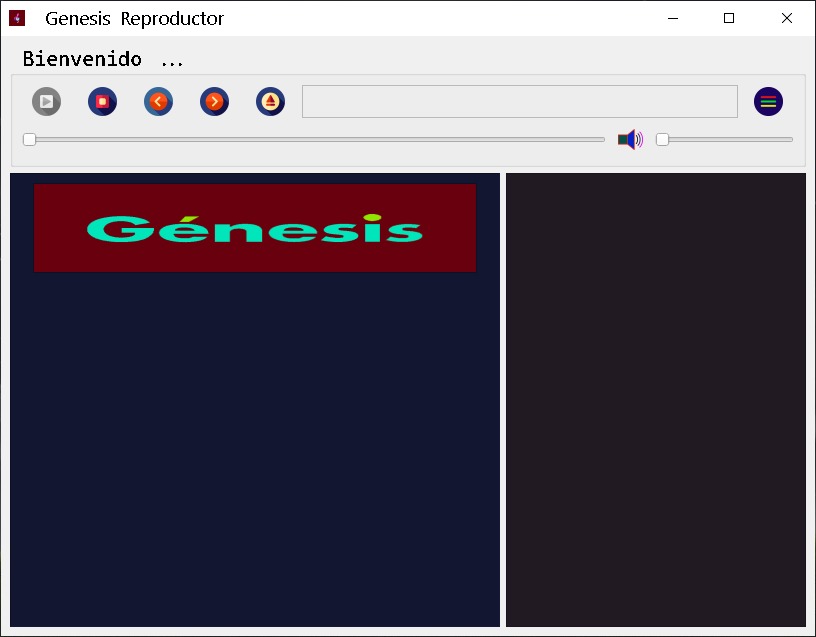

# Reproductor Genesis

# Abre tu corazón y escucha hoy su voz

## Tecnologias usadas [PyQt 5], [Python 3], [Pyqt5 Tools]

[PyQt 5]: https://www.riverbankcomputing.com/software/pyqt/download5

[Python 3]: https://www.python.org/ftp/python/3.8.2/python-3.8.2-amd64.exe

[Pyqt5 Tools]: https://pypi.org/project/pyqt5-tools/

## Este proyecto esta dedicado a todos aquellos que tienen ganas de aprender .. y es posible gracias a DIOS y a nuestros colaboradores

##  ***@abeljm*** , [***@fhernd***] ,  ***@unihernandez22***

[***@fhernd***]: https://github.com/Fhernd

## Indispensable instalar estas tecnologias

## MatroskaSplitter y LAVFilters (Codecs), para que pueda reproducir videos y audio si estas en Windows 10

## [LAVFilters]
[LAVFilters]: https://github.com/Nevcairiel/LAVFilters/releases

## [MatroskaSplitter]
[MatroskaSplitter]: https://haali.su/mkv/
-------------------------------------------------------

<!--  -->
<!-- Sitio Web que contiene Open Codec -->
<!-- https://xiph-org-open-codecs.software.informer.com/download/ -->
